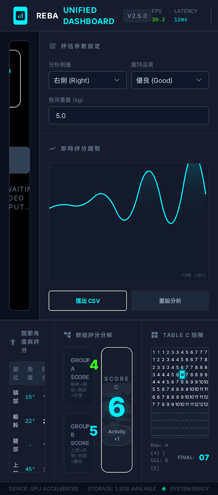

# REBA Tool

基於 MediaPipe 姿態估計的 **REBA (Rapid Entire Body Assessment)** 人因工程分析工具。即時分析攝影機或影片中的關節角度，計算 REBA 分數，評估工作場所人因風險等級。



## 功能特色

- **即時姿態分析** — 透過 MediaPipe Holistic 偵測 33 個人體關鍵點，計算頸部、軀幹、上臂、前臂、手腕、腿部共 6 個關節角度
- **完整 REBA 評分** — 實作 Table A (5x3x2)、Table B (6x2x3)、Table C (12x12) 查表，含負荷、握持、活動調整因子
- **五級風險判定** — 可忽略 / 低 / 中等 / 高 / 極高，搭配顏色編碼與行動建議
- **多輸入來源** — 支援即時攝影機與影片檔案
- **影片錄製** — 背景線程非阻塞寫入，不影響 GUI 流暢度
- **資料匯出** — CSV、JSON、Markdown 格式的分析報告與統計
- **三種 UI 版本** — Widget 原版、QML 原版佈局、QML 霓虹 Dashboard

## 技術棧

| 類別 | 技術 |
|------|------|
| 語言 | Python 3.11+ |
| GUI 框架 | PySide6 / Qt6 (Widgets + QtQuick/QML) |
| 姿態估計 | MediaPipe Holistic |
| 影像處理 | OpenCV, PIL/Pillow |
| 數值計算 | NumPy, SciPy, scikit-learn |
| 資料分析 | Pandas, Matplotlib |

## 快速開始

### 安裝

```bash
# 使用 uv (推薦)
uv sync

# 或使用 pip
pip install -e .
```

### 執行

```bash
# Widget 版 (原版)
uv run python src/reba_tool/MediaPipeApp.py

# QML 版 (原版佈局)
uv run src/reba_tool_qml/main.py

# QML Code 版 (霓虹 Dashboard)
uv run src/reba_tool_qml_code/main.py
```

## 架構

```
src/
├── reba_tool/                    ← Widget 版 + 共用後端
│   ├── MediaPipeApp.py           ← Widget 版入口
│   ├── angle_calculator.py       ← 關節角度計算 (MediaPipe → 6 角度)
│   ├── reba_scorer.py            ← REBA 評分核心 (Table A/B/C + 風險等級)
│   ├── data_logger.py            ← 資料記錄 (CSV/JSON/Markdown)
│   ├── event_bus.py              ← 線程安全事件匯流排 (取代 Qt Signal/Slot)
│   ├── video_controller.py       ← ViewModel 協調者 (零 Qt 依賴)
│   ├── video_pipeline.py         ← 影片處理管線 (偵測→計算→繪圖)
│   ├── frame_renderer.py         ← OpenCV/PIL 繪圖 (骨架、角度線、REBA 標註)
│   ├── processing_config.py      ← 非 Qt 參數配置
│   └── ui/                       ← 薄 Qt Widget 層
│       ├── main_window.py
│       ├── video_worker.py       ← QThread 包裝
│       ├── qt_config.py
│       └── table_c_dialog.py
│
├── reba_tool_qml/                ← QML 版 (原版佈局, LeftPanel/RightPanel)
│   ├── main.py                   ← QML 版入口
│   ├── bridge/                   ← Python↔QML 橋接層 (QObject 子類)
│   │   ├── video_bridge.py       ← 影片控制 + 錄影
│   │   ├── reba_bridge.py        ← REBA 分數更新
│   │   ├── image_provider.py     ← QQuickImageProvider (即時影像)
│   │   ├── data_bridge.py        ← 資料匯出/統計
│   │   ├── video_recorder.py     ← 錄影 (Queue + 背景線程)
│   │   ├── table_c_model.py      ← Table C 矩陣 (QAbstractTableModel)
│   │   └── score_table_model.py  ← 分數表模型
│   ├── qml/                      ← QML UI 元件
│   │   ├── main.qml
│   │   ├── panels/               ← 面板元件
│   │   ├── components/           ← 可重用元件
│   │   └── style/Theme.qml      ← 主題 Singleton
│   └── config/                   ← JSON 主題配置 (default/dark/high_contrast/neon)
│
└── reba_tool_qml_code/           ← QML Code 版 (霓虹 Dashboard)
    ├── main.py                   ← Code 版入口
    ├── bridge/                   ← 複用 reba_tool_qml 的 bridge 層
    ├── qml/                      ← 深色霓虹 Dashboard UI
    │   ├── main.qml              ← Header + Video/Side + Bottom + Footer
    │   ├── panels/               ← VideoArea, SidePanel, JointTable, GroupScores, TableCMatrix
    │   ├── footer/StatusBar.qml
    │   └── style/Theme.qml      ← 霓虹主題 Singleton
    └── config/theme_dark_neon.json
```

### 資料流

```
[Worker Thread]                    [Main Thread]              [QML Render]
VideoPipeline.run()
  → MediaPipe 偵測
  → 角度計算 + REBA 評分
  → 繪圖渲染
  → EventBus.emit('frame_processed')
    → VideoWorker.frame_ready Signal → VideoBridge._handle_frame()
                                        → image_provider.update_frame()
                                        → reba_bridge.update_from_frame()
                                        → recorder.write_frame(queue.put)
                                                                → QML Image 綁定更新
                                                                  REBA 分數/風險即時顯示
                                       [Recorder Thread]
                                        → queue.get() → cv2.VideoWriter.write()
```

## REBA 評分流程

```
MediaPipe Pose Landmarks (33 關鍵點)
        │
        ▼
  AngleCalculator ─→ 6 個關節角度 (neck, trunk, upper_arm, forearm, wrist, leg)
        │
        ├─── Group A (軀幹側) ──→ Table A [5x3x2] + 負荷分數 = Score A
        │    trunk + neck + leg
        │
        ├─── Group B (手臂側) ──→ Table B [6x2x3] + 握持分數 = Score B
        │    upper_arm + forearm + wrist
        │
        └─── Table C [12x12] ──→ Score C + 活動分數 = REBA 最終分數
                                        │
                                        ▼
                                  風險等級 (5 級)
```

| REBA 分數 | 風險等級 | 行動建議 |
|-----------|---------|---------|
| 1 | 可忽略風險 | 不需要處理 |
| 2–3 | 低風險 | 有需要時再改善 |
| 4–7 | 中等風險 | 進一步調查及必要時改善 |
| 8–10 | 高風險 | 近日內需調查及改善 |
| 11–15 | 極高風險 | 必須立即調查及改善 |

## 開發

### 程式碼品質

```bash
black src/         # 格式化
flake8 src/        # Lint
pytest             # 測試
```

### Git 工作流

```bash
git checkout -b feature/[name]
git commit -m "type(scope): description"
```

### 驗證

```bash
# QML 版無錯誤
uv run src/reba_tool_qml/main.py 2>&1 | findstr /i "error unavailable TypeError"

# QML Code 版無錯誤
uv run src/reba_tool_qml_code/main.py 2>&1 | findstr /i "error unavailable TypeError Expected"
```

## 關鍵點與角度計算

### MediaPipe 關鍵點

本工具使用 **MediaPipe Holistic** 偵測人體 33 個關鍵點（Pose Landmarks），從中擷取以下關鍵點進行 REBA 角度計算：

```
          NOSE (0)
     L_EYE (2) ─── R_EYE (5)
     L_EAR (7)     R_EAR (8)
            │
  L_SHOULDER (11) ─── R_SHOULDER (12)    ← 肩膀中點用於頸部/軀幹
       │                    │
  L_ELBOW (13)        R_ELBOW (14)
       │                    │
  L_WRIST (15)        R_WRIST (16)
       │                    │
  L_INDEX (19)        R_INDEX (20)       ← 手指用於手腕角度
            │
     L_HIP (23) ─── R_HIP (24)          ← 臀部中點用於軀幹角度
       │                    │
  L_KNEE (25)         R_KNEE (26)
       │                    │
  L_ANKLE (27)        R_ANKLE (28)
```

> 可見度閾值 `min_visibility = 0.5`，低於此閾值的關鍵點視為不可見，該角度回傳 `None`。

### 六個 REBA 角度計算方式

| #   | 角度               | 計算方式                                          | 使用關鍵點                       | 0° 定義      | 顏色   |
| --- | ------------------ | ------------------------------------------------- | -------------------------------- | ------------ | ------ |
| 1   | **頸部** (Neck)    | 眼睛中點→肩膀中點連線與**垂直線**的夾角           | L/R Eye, L/R Shoulder            | 頭部正上方   | 🔴 紅 |
| 2   | **軀幹** (Trunk)   | 肩膀中點→臀部中點連線與**垂直線**的夾角           | L/R Shoulder, L/R Hip            | 身體直立     | 🟠 橙 |
| 3   | **上臂** (Upper Arm) | 肩膀→肘部連線與**重力垂直線**的夾角             | Shoulder, Elbow (單側)           | 手臂自然下垂 | 🟡 黃 |
| 4   | **前臂** (Forearm) | 肘關節內角 → 屈曲角度 `\|180° - 內角\|`           | Shoulder, Elbow, Wrist (單側)    | 完全伸直     | 🔵 青 |
| 5   | **手腕** (Wrist)   | 手腕關節內角 → 偏差角度 `\|180° - 內角\|`         | Elbow, Wrist, Index (單側)       | 中性直線     | 🟢 綠 |
| 6   | **腿部** (Leg)     | 膝關節內角 → 屈曲角度 `\|180° - 內角\|`           | Hip, Knee, Ankle (單側)          | 完全伸直     | 🔵 藍 |

### 角度計算方法

**方法一：與垂直線夾角**（頸部、軀幹、上臂）

```
計算兩點連線向量 V = P_upper - P_lower（僅使用 x, y 座標）
垂直參考向量 V_ref = [0, -1]（向上）
θ = arccos( dot(V, V_ref) / (|V| × |V_ref|) )
```

**方法二：三點夾角 → 屈曲角度**（前臂、手腕、腿部）

```
三點 P1、P2（頂點）、P3 形成的內角：
V1 = P1 - P2,  V2 = P3 - P2
inner_angle = arccos( dot(V1, V2) / (|V1| × |V2|) )

屈曲角度 = |180° - inner_angle|
  → 180° 內角 = 0° 屈曲（完全伸直）
  → 90° 內角 = 90° 屈曲（直角彎曲）
```

### 角度→REBA 評分對照

#### Group A（軀幹側）

| 部位 | 分數 1             | 分數 2         | 分數 3 | 分數 4 | 調整                              |
| ---- | ------------------ | -------------- | ------ | ------ | --------------------------------- |
| 軀幹 | ≤5°                | 5–20°          | 20–60° | >60°   | 扭轉/側彎 +1 (max 5)             |
| 頸部 | ≤20°               | >20°           | —      | —      | 扭轉/側傾 +1 (max 3)             |
| 腿部 | 雙腳支撐且 ≤30°    | 其他           | —      | —      | 屈曲 30–60° +1, >60° +2 (max 4)  |

#### Group B（手臂側）

| 部位 | 分數 1  | 分數 2          | 分數 3 | 分數 4 | 調整                                        |
| ---- | ------- | --------------- | ------ | ------ | ------------------------------------------- |
| 上臂 | ≤20°    | 20–45°          | 45–90° | >90°   | 外展/旋轉 +1, 肩抬高 +1, 有支撐 -1 (max 6) |
| 前臂 | 60–100° | <60° 或 >100°   | —      | —      | 無 (1–2)                                    |
| 手腕 | ≤15°    | >15°            | —      | —      | 扭轉/橈尺偏 +1 (max 3)                      |

## 參考文獻

Hignett, S., & McAtamney, L. (2000). Rapid entire body assessment (REBA). *Applied Ergonomics*, 31(2), 201-205.

## 授權

[Apache License 2.0](LICENSE)